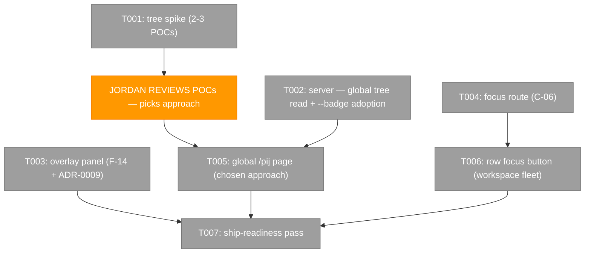
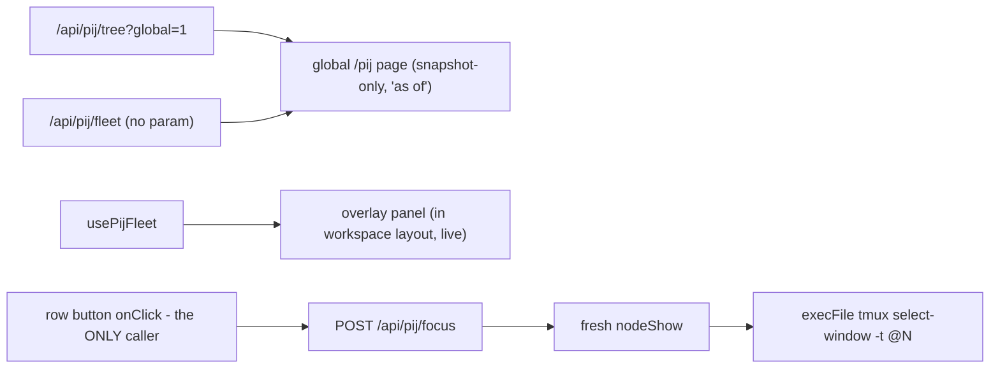

# Phase 4: Global prime tree + overlay panel — Tasks & Context Brief

**Plan**: `docs/plans/089-first-class-pij/first-class-pij-plan.md` (v1.1.0, READY)
**Phase**: 4 of 4 · **Depends on**: Phases 1–3 (shipped `1c8a0fcaf`, `2151a69fe`, `156537c46` — all reviews APPROVE)
**Design reference (RATIFIED)**: `scratch/pij-observatory-poc.html` — global tab (prime roots grouped by folder, `<details>` sections, same node renderer as the workspace tree). Light default, theme-aware.
**Complexity**: CS 4 (mid-phase human checkpoint + the one mutating route)

---

## Executive Briefing

- **Purpose**: The global lens and the quick-glance surface — with Jordan's taste in the loop before the tree is built for real, plus the single sanctioned mutation of v1: click a seat, land in its tmux window.
- **What We're Building**: (1) a throwaway tree-rendering spike Jordan reviews mid-phase; (2) the global `/pij` page (primes as roots with paths, expandable fleets, ~181 live seats); (3) the header-cluster overlay panel (F-14 sibling, SDK command + keybinding); (4) `POST /api/pij/focus` → `tmux select-window` under C-06; (5) ship-readiness. Plus one riding adoption: `pij list --badge` (landed upstream today).
- **Goals**:
  - ✅ AC-05 global half at live scale (tree + grouping; the phase-position chip clause closes as a recorded absent-not-faked — see T005/T007); AC-10 (focus route audits); AC-12 (overlay incl. state-survives-navigation)
  - ✅ Jordan reviews spike POCs BEFORE the real tree is built (his explicit ask — a mid-phase human gate)
  - ✅ The ONE mutating route ships with C-06 proof: only call site is the route handler; only client caller is the row-button onClick
  - ✅ Badge column goes live via `--badge` adoption
- **Non-Goals**:
  - ❌ Any second mutating route or auto-fired focus (no event handler, effect, or timer may reach the focus caller)
  - ❌ tmux attach, keystrokes to panes, pane resize (observer-perturbs-instrument — R-01)
  - ❌ Live SSE on the global page (no provider outside the workspace layout — snapshot-only is the DESIGNED v1, rendered honestly with "as of")
  - ❌ needs-human/questions UI (dove is building the platform side under 073; additive later)

## Prior Phase Context

### Phases 1–2 (condensed — full detail in P2/P3 dossiers)
Read layer + poller + `pij` channel + snapshot routes (P1); fleet page with prime shells, containment, empty states, provenance (P2). Route shape: `handlePij*Request(request, deps)` exported, thin `GET` binding `{ authFn: auth, poller: getPijPoller() }`, `requirePijSession` first, `NO_STORE_HEADERS`, 503 `storeUnreadable` with verbatim `E-` code. `PijRouteDeps` now also carries optional `noteWorkspace?`.

### Phase 3 (the surface this phase extends)

**A. Deliverables**: Flows tab (`flows-tab.tsx`, `flow-plan-card.tsx`, `flow-state-badge.tsx`, `phase-rail.tsx`), `flow-watcher.ts` + wiring, additive `receivedCount` on `useChannelEvents`, `docs/how/pij-observatory.md` § flow view.

**B. Dependencies Exported**:
- `usePijFleet({ workspacePath, scope?, fetchImpl?, treeRefetchDebounceMs? })` → `{ rows, status, seq, phase, tree, flows, filteredOut, flowsFilteredOut, errors, refresh }`. `PijPageClientProps = { workspacePath, workspaceName, fetchImpl? }`.
- Tab mechanism: 3 tabs (`fleet`/`tree`/`flows`), `onTabChange = setTab + refresh()`, page-level `now` (5s).
- Watcher: `createFlowWatcher(deps)`, singleton `getPijFlowWatcher()`, `notePijFlowWorkspace(path)`; constants `PLANS_SUBDIR`, `FLOW_DOCUMENT`, `FLOW_DEBOUNCE_MS`; `assertNotPijShaped()`.
- `useChannelEvents` → `{ messages, receivedCount, isConnected, clearMessages }`; `PIJ_CHANNEL_RETENTION = 1_000`.
- Flows-tab absence pattern: `FlowsAbsenceReason`, `flowsAbsenceReason()` discriminator — the designed-states shape 4.2/4.3 mirror.

**C. Gotchas & Debt (task inputs)**:
1. **`windowId` is ABSENT from `pij list` rows today** (verified live: 0 of 181) — it exists only on `pij node show` (`windowId: '@220'`, globally unique per tmux server, no session qualifier needed). The focus route MUST resolve seat→window server-side via a fresh `nodeShow` at click time — never trust a client-sent windowId. ⚠ **`node show` has NO `folder` key — the working directory is `cwd`** (same value as the list row's `folder`; verified live against the full key list). `PijNodeDetail` types neither `cwd` nor `liveness` nor `lastEventAt` today (they fall through the index signature as `unknown`) — T004 adds them as typed additive fields. A test fake that invents a `folder` key would green-test the wrong field: fixtures must mirror the real key set.
2. **No SSE provider outside the workspace layout** (`MultiplexedSSEProvider` only in `workspaces/[slug]/layout.tsx:102`) — the global `/pij` page has NO `useChannelEvents` context: snapshot-only with visible "as of" + refresh affordance is the designed v1.
3. `/api/pij/tree` and `/api/pij/flow` require `workspace`; only `/api/pij/fleet` is global. The CLI supports `pij tree --global` (verified live; `tree` already in `PIJ_READ_VERBS`) — the POC's global tab consumed exactly that dump, grouping roots by `folder`.
4. **`'unlink'`-class fence reality**: the C-02 sweep is deliberately blunt — the focus route's mutating tmux call needs a deliberate carve-out with a companion assertion (the `pij-records.ts`/`flow-watcher` denylist-split precedent), never a weakening.
5. `FileWatcherOptions.atomic` is a no-op in the native adapter — set `false` explicitly if touched.
6. Radix Tabs fire on `mousedown` — use `fireEvent.mouseDown` in tab tests.
7. Tinykeys map is built ONCE at mount — the keybinding must be registered statically via the bootstrap path (ADR-0009 contribution), never dynamically.
8. Pre-existing baseline: exactly 3 dashboard-navigation failures — count before and after.
9. Riding: AC-01 in-browser probe + watcher end-to-end probe both await Jordan at phase review (dev-server restart); role-chip ack outstanding; `joinTeamToFlow` rung 1 dormant pending dove's plan-id flag.

**D. Phase 4 surface recon (verified against source)**:
- **Header cluster**: `ThemeToggle` lives in the `dashboard-sidebar.tsx` top cluster (~96–150); existing overlay buttons live in `SidebarFooter` (~293–311) and dispatch `window.dispatchEvent(new CustomEvent('terminal:toggle'))`-style CustomEvents (the sidebar sits outside the overlay providers). **`dashboard-sidebar.tsx` is in scope for exactly TWO additive elements, one per task**: T003's overlay-toggle button (in the established footer cluster) and T005's `/pij` nav entry — the sidebar has NO existing top-level nav list to slot into (only `WorkspaceNav` + the collapsed Dev group), so T005 adds a small new `SidebarGroup` ABOVE the Dev group holding the single "Pij fleet" → `/pij` item (const in `navigation-utils.ts`, not inline). The P2-era do-not-touch is lifted for this phase only, for exactly those two elements.
- **F-14 overlay pattern** (**three** anchored siblings identical — terminal/notes/pr-view; **question-popper is an OUTLIER** missing `isOpeningRef`, `zIndex: 44`, and anchor measurement — do NOT copy it; **copy `pr-view-overlay-wrapper.tsx` + `use-pr-view-overlay.tsx` + `pr-view-overlay-panel.tsx` line-by-line**): wrapper in `workspaces/[slug]/` composed in `layout.tsx:100-110` = always-mounted context provider + `dynamic(import, { ssr: false })` panel + ErrorBoundary rendering `null`; provider listens for its `*:toggle` CustomEvent, dispatches `overlay:close-all` before opening (mutual exclusion, Plan 065) with `isOpeningRef` self-close guard; Escape closes; panel `position: fixed`, **`zIndex: 44`** (same as terminal — "over" = opened later + close-all), geometry from `document.querySelector('[data-terminal-overlay-anchor]')` via ResizeObserver, `hasOpened` lazy guard, `display: isOpen ? 'flex' : 'none'`.
- **ADR-0009 SDK registration**: per-domain `sdk/contribution.ts` (`SDKContribution { domain, commands: [{id,title,domain,category,params:z.object({}),icon}], keybindings: [{key,command}] }`) + `sdk/register.ts` (`registerXxxSDK(sdk)`: command handler dispatches the CustomEvent; keybindings registered per binding) + ONE import+call in `app-composition/sdk-domain-registrations.ts` `registerAllDomains()`. Keys in use: `` Backquote ``, `$mod+Shift+KeyR`, `$mod+Shift+KeyL`, `$mod+Shift+KeyP`, `$mod+KeyP`, `$mod+Comma`, `$mod+Shift+KeyU`, `Shift+Escape`. **`$mod+Shift+KeyF` verified free (zero matches across all contributions + sdk-bootstrap) — use it.**
- **tmux execution**: mirror the feature's own `nodeExecFileExecutor` (`pij-records.ts:232-246`) — `execFile` fixed argv, no shell, timeout, injectable seam. NEVER the `api/terminal/route.ts` `execSync`-string precedent.

**E. Patterns to Follow**: F-14 + ADR-0009 as above; route shape with injected deps; designed absence states (reason union + pure discriminator + distinct `data-reason` + N-states-N-test-ids); fakes never `vi.mock()`; TDD RED-first with verbatim logs; `now` as parameter; observations never verdicts; spike code is throwaway in `scratch/`, learnings promoted to the execution log.

## Pre-Implementation Check

| File | Exists? | Domain Check | Notes |
|------|---------|-------------|-------|
| `scratch/pij-tree-spike/` (2–3 throwaway HTML/TSX POCs) | create | scratch (gitignored) | real `pij tree --global` JSON as input |
| `apps/web/src/features/089-first-class-pij/server/pij-records.ts` + interface | modify (additive) | 089 server | `tree({ global: true })` variant — `--global` argv, no cwd |
| `apps/web/app/api/pij/tree/route.ts` | modify (additive) | 089 | accept `workspace` OR `global=1` (400 if neither) |
| `apps/web/src/features/089-first-class-pij/server/pij-records.ts` (line ~124) | modify | 089 server | **the list argv lives HERE, not in the poller** (`pij-poller.service.ts:233` is a bare `records.list()`): add `--badge` to the fixed argv in `list()` — a deliberate contract note: every `list()` call now requests badges (+~0.2s per dove's measurement, poller is the only production caller, 8s loop absorbs it) |
| `apps/web/app/(dashboard)/pij/page.tsx` | create | app shell → 089 | global page OUTSIDE workspace layout (no SSE — designed) |
| `apps/web/src/features/089-first-class-pij/components/{global-tree.tsx,pij-overlay-panel.tsx}` | create | 089 | |
| `apps/web/app/(dashboard)/workspaces/[slug]/pij-overlay-wrapper.tsx` + `[slug]/layout.tsx` | create/modify | app shell | 5th F-14 sibling |
| `apps/web/src/features/089-first-class-pij/hooks/use-pij-overlay.tsx` | create | 089 | provider hook per F-14 |
| `apps/web/src/features/089-first-class-pij/sdk/{contribution.ts,register.ts}` + `app-composition/sdk-domain-registrations.ts` | create/modify | 089 + app shell | ADR-0009 |
| `apps/web/src/components/dashboard-sidebar.tsx` | modify (additive, THIS PHASE ONLY) | app shell | one overlay-toggle button in the established cluster |
| `apps/web/app/api/pij/focus/route.ts` | create | 089 | the ONE mutating route (Domain Manifest) |
| `test/unit/web/pij/{global-tree,pij-overlay,focus-route,...}.test.*` + `fence.test.ts` | create/modify (additive) | 089 | focus carve-out + companion |

No duplication: no existing global page/overlay/focus surface. Contract changes: `IPijRecords.tree` gains an options variant (additive); everything else additive.

## Architecture Map



## Tasks

| Status | ID | Task | Domain | Path(s) | Done When | Notes |
|--------|-----|------|--------|---------|-----------|-------|
| [x] | T001 | **Spike** (throwaway): capture a real `pij tree --global --json` dump; build 2–3 materially different tree renderings at real scale (~181 seats) in `scratch/pij-tree-spike/` — e.g. (a) the POC's folder-grouped `<details>` sections, (b) an indented virtualized list, (c) a collapsible-columns/treemap variant; each openable in a browser, light mode. **STOP after building: report to the orchestrator for Jordan's review — his pick gates T005.** Record go/no-go + chosen approach + discovered constraints (render cost at scale, readability) in the execution log | 089 (scratch) | `scratch/pij-tree-spike/*` | POCs exist and open; comparison notes in execution log; orchestrator notified with one-line-per-POC summary | Plan 4.1 — Jordan's explicit checkpoint. Spike code is discarded; learnings promoted. Do T002/T003/T004/T006 while awaiting the pick |
| [x] | T002 | Server: (a) additive `tree` global variant — `IPijRecords.tree` accepts `{ cwd } \| { global: true }` → `pij tree --global --json` (no cwd; still fixed argv, still read-only allowlist); `/api/pij/tree` accepts `workspace=<path>` OR `global=1` (400 if neither; both = 400 ambiguous). (b) `--badge` adoption: add `--badge` to the fixed argv in `pij-records.ts` `list()` (~line 124 — NOT the poller, which calls `records.list()` bare); badge lands on `FleetRow.badge` via the existing `toFleetRow` mapping unchanged; **two observed states only** (live-measured: with the flag 181/181 rows carry a string badge, 0 null; without it the key is absent 181/181): key absent → absence rendering, string → rendered verbatim — no null leg exists to test | 089-first-class-pij | `server/pij-records.ts`, `server/pij-records.interface.ts`, `app/api/pij/tree/route.ts`, tests | Fake-executor tests: `list` argv now includes `--badge`; `--global` argv correct; both-params 400; badge column renders live values (fixture: row with `badge: 'blocked'` shows it verbatim; row without the key keeps the absence rendering) | Upstream landed today: `--badge` hoisted (~0.65s at 179 rows, dove-measured); `tree` already in `PIJ_READ_VERBS`; AC-03: consumed verbatim, never re-derived |
| [x] | T003 | Overlay panel — 5th F-14 sibling: `pij-overlay-wrapper.tsx` in `[slug]/` + provider hook (`pij:toggle` CustomEvent, `overlay:close-all` + `isOpeningRef`, Escape) + `dynamic(ssr:false)` panel at `zIndex: 44` measuring `[data-terminal-overlay-anchor]`; compact fleet list INSIDE the workspace layout (SSE context available — reuse `usePijFleet`, render a condensed seat list w/ state+badge+freshness); ADR-0009: `sdk/contribution.ts` + `sdk/register.ts` (command `pij.toggleOverlay` dispatching the event) + one line in `registerAllDomains()`; keybinding `$mod+Shift+KeyF`; one additive toggle button in the `dashboard-sidebar.tsx` cluster (the established CustomEvent pattern) | 089-first-class-pij + app shell | `apps/web/app/(dashboard)/workspaces/[slug]/pij-overlay-wrapper.tsx`, `[slug]/layout.tsx`, `hooks/use-pij-overlay.tsx`, `components/pij-overlay-panel.tsx`, `sdk/{contribution,register}.ts`, `app-composition/sdk-domain-registrations.ts`, `components/dashboard-sidebar.tsx` (additive), tests | AC-12: toggle via button + command + keybinding (test each dispatch path); close-all mutual exclusion test; panel renders fleet rows from `FakePijApi`; ErrorBoundary renders null on failure; **open/closed state survives an in-workspace route change** (test: open panel, rerender under a new `[slug]` child route, still open — state lives in the always-mounted provider, NEVER in the lazily-mounted panel); T003's sidebar diff is exactly one button | F-14 pattern verbatim; sidebar edit additive-only, THIS phase's sanctioned touch |
| [x] | T004 | Focus route — the ONE mutating route: `POST /api/pij/focus` body `{ seatId }`; `requirePijSession` first; **type additions first**: `PijNodeDetail` gains typed additive `cwd?: string`, `liveness?: string`, `lastEventAt?: string \| null` (verified live on `node show`; fixtures mirror the REAL key set — no `folder` key exists there); resolve seat via FRESH `nodeShow(seatId)`; validation ladder with the **`focusReason` union** (machine `reason` field in every non-200 body + exact observation wording): `unknown-seat` 404 "no seat <id> in the store" · `out-of-workspace` 409 "seat <id> works in <cwd>, outside this workspace" (containment on `detail.cwd` vs `workspace` param, same relative-path rule) · `not-live` 409 "seat <id> last observed <liveness> at <lastEventAt>" (rule: `liveness !== 'active'`; **absent `liveness` → its own wording "liveness not observable for <id>", never inferred from `lastEventAt`**) · `no-window` 409 "seat <id> has no tmux window on record" · `store-unreadable` 503 with the `E-` code verbatim; success → `execFile('tmux', ['select-window','-t', windowId])` via an injectable executor mirroring `nodeExecFileExecutor`, 200 body `{ focused: windowId }`; fence: C-02 carve-out for exactly this file + companion assertion (only mutating call is `tmux select-window`; no pij mutating verb anywhere) — planted-offender RED proof | 089-first-class-pij | `apps/web/app/api/pij/focus/route.ts`, `server/pij-records.interface.ts` (additive types), `server/route-deps.ts` (additive), `test/unit/web/pij/focus-route.test.ts`, `test/unit/web/pij/fence.test.ts` (additive) | AC-10 route half: every `focusReason` has a test (N-reasons-N-tests per the designed-states pattern); executor fake records exact argv; **code audit test: the only `select-window` call site in app code is this route handler**; fence carve-out proven non-weakening | C-06: route = server half, T006 = client half. Never `execSync`, never shell strings. The wordings above are the contract T006 renders verbatim |
| [x] | T005 | Global `/pij` page (AFTER Jordan's T001 pick): `app/(dashboard)/pij/page.tsx` OUTSIDE the workspace layout — primes as roots with their paths, expandable fleets beneath (chosen rendering), grouped per the ratified POC's global tab (by `folder`, chainglass open by default); data = global fleet snapshot (`/api/pij/fleet`, no param) + global tree (`/api/pij/tree?global=1` from T002); **snapshot-only by design** (no SSE provider here): visible "as of Xs" + refresh button, honest empty/error states per the designed-states pattern; nav entry (top-level, not workspace-scoped) | 089-first-class-pij + app shell | `apps/web/app/(dashboard)/pij/page.tsx`, `components/global-tree.tsx`, nav (top-level entry), tests | AC-05 global half at live scale (181 rows, of which ~50 `active` — say "rows", never "live seats"; live smoke in log); snapshot-only rendered honestly (its own `data-reason` for staleness); approach matches Jordan's pick, recorded in the log; nav entry = the new `SidebarGroup` above Dev (§ D recon — no existing top-level slot); **AC-05's phase-position chip clause is a recorded DELIBERATE ABSENCE on this page**: the chip requires the seat→flow join (rung 1 dormant until dove's plan-id flag) AND a flow source (`/api/pij/flow` is workspace-scoped) — per the clause's own ruling text the chip is "absent (not faked) when no live flow joins", which today is every seat; it lights up additively when upstream linkage lands. Recorded in T007's enumeration | BLOCKED on Jordan's spike review — build T002/T003/T004/T006 first if the pick hasn't landed |
| [x] | T006 | Row focus button in the WORKSPACE fleet view: per-seat button (only where the seat's workspace is the current one) → POST `/api/pij/focus`; disabled state when out-of-scope; result feedback as observation ("focused @220" / the 409 wording verbatim) | 089-first-class-pij | `components/seat-row.tsx` (or sibling), `test/unit/web/pij/fleet-view.test.tsx` (extend) | AC-10 client half: **audit test — the only caller of the focus POST is the row-button onClick; no event handler, effect, or timer reaches it** (grep-style test over the feature's client source); button absent in global scope | C-06 client half; works with Jordan's in-browser 064 xterm (already-attached client — ratified 4.4) |
| [x] | T007 | Ship-readiness: `docs/how/pij-observatory.md` COMPLETE (all four phases; deliberate absences enumerated: no attach, no keystrokes, no auto-focus, no seat dimension on flows, no removal signal, advisory `next`, snapshot-only global, needs-human/questions deferred to dove's 073, **AC-05's phase-position chip absent-not-faked pending the seat→flow linkage (dove's plan-id flag) — the Jordan-ruled clause's own wording sanctions the absence, and the AC closes with that status recorded honestly, not as ✅**); `domain.md` final (focus route in the Domain Manifest as the one mutation); full `pnpm vitest run test/unit/web/pij/` + sse + consumer suites + `npx tsc -p tsconfig.test.json --noEmit` + `pnpm build` green; dashboard-navigation baseline exactly 3; every AC demonstrable and named in the log (AC-01/watcher probes remain written-and-pending Jordan's restart — list them as such, never as done) | 089-first-class-pij | (whole phase) + docs | All gates verbatim-logged; ACs mapped to proving tests/probes; docs list every not-shown-on-purpose | Plan 4.5 |

## Context Brief

**Environment-first posture**: friction is work — fix small/reversible, else Discoveries row; pay forward.

**Key constraints applied**: C-06 (focus = the one mutation, human-click-only, both halves audit-tested); R-01 (never attach/resize/keystroke panes); C-02 (carve-out with companion, never weakening); C-03 (no pane/pid in DOM — windowId is displayed only as the focus result observation); display doctrine (observations, absences, provenance) everywhere.

**The mid-phase human gate**: T001's spike review is Jordan's explicit checkpoint (plan 4.1). Protocol: nigel builds POCs → reports one line per POC → orchestrator surfaces to Jordan → Jordan's pick recorded in the execution log as a decision row → T005 proceeds. T002/T003/T004/T006 are deliberately independent of the pick — build them while waiting.

**Reusable**: `FakePijApi` (+ add focus-route support if needed), `fleet-ui.ts`/`flow-ui.ts` fixtures, `FakePijExecutor` (`ANY_CWD`) for the tree `--global` and focus argv tests, the F-14 siblings as line-by-line precedent, `flowsAbsenceReason` designed-states shape.

**Data flow (new surfaces)**:


## Discoveries & Learnings

_Populated during implementation by the implement verb._

| Date | Task | Type | Discovery | Resolution | References |
|------|------|------|-----------|------------|------------|
| 2026-07-26 | T005 | Discovery | Live, 11 of 20 fleet folders have NO seat in the global tree at all. Keying folder sections off the tree would have dropped more than half the machine's folders from the global view | `groupByFolder` builds sections from the union of both reads, so a folder present only in the fleet still appears with 0 in tree | `components/global-tree.tsx`, `global-tree.test.tsx` |
| 2026-07-26 | T005 | Friction | First draft used `process.cwd()` to decide which folder opens by default — a node API inside a client component, which would have broken in the browser | Replaced with "the busiest folder opens". The ratified POC could name chainglass because it was a fixture; the global page has no workspace context to privilege a folder with | `components/global-tree.tsx` |
| 2026-07-26 | T005 | Decision | Jordan picked POC A **directly in-session** rather than via the orchestrator relay; an orchestrator hygiene instruction (pause watchdog, `state set … waiting`) arrived afterwards based on the pre-pick state | Declined on the facts — both would have marked the seat idle while actively building, and `state set` is on the feature's own mutating-verb denylist. Orchestrator confirmed: questions stay with their context owner, the pick supersedes the hygiene message | execution log decision row |
| 2026-07-26 | T004 | Discovery | Live check of the focus ladder over all 8 chainglass seats: 7 focusable, 1 correctly refused as `not-live(stale)`. `hasFolder=false` on **all 8** — the cwd-not-folder trap confirmed fleet-wide, not just on the sampled fixture | Recorded; no code change needed — the route already reads `cwd`. Confirms the fixture mirrors reality | execution log, "Live check" |
| 2026-07-26 | T004 | Open question | **`windowId` is not a seat identity.** 45 live seats occupy 25 windows; 13 windows hold 2–4 seats each. Focusing a seat raises a window that usually contains other agents, and `select-window` cannot pick the pane. `focused @2437` is literally true but may imply the seat itself was surfaced | NOT improvised. `select-pane` would be a second pane-touching tmux verb (outside C-06/R-01); naming the sharing needs a second read at click time. Both raised to the orchestrator for a ruling; documented as a known limitation meanwhile | `docs/how/pij-observatory.md`, execution log |
| 2026-07-26 | T001 | Discovery | `pij tree --global` returns 52 nodes / 30 roots / 9 folders while `pij list` returns 181 rows / 20 folders. The 129 rows missing from the tree are EXACTLY the dead ones (in-tree: 50 active + 2 stale; not-in-tree: 129 dead, no exceptions). The dossier's "~181 seats at real scale" describes the fleet, not the tree | Framed as the spike's headline finding and put to Jordan as a design question ("what does the global page do with 129 dead records?"); each POC answers it differently. Corollary recorded: at depth 2 / fanout 3 the tree needs no virtualization — cost comes from the dead | `scratch/pij-tree-spike/`, execution log T001 |
| 2026-07-26 | T001 | Friction | No browser available to measure real render cost (Zen not running; starting one would perturb Jordan's environment) | Verified all three POCs headlessly with jsdom (`verify.mjs`) and labelled the timings as string-build, not paint. Each page stamps its own real figure when opened | `scratch/pij-tree-spike/verify.mjs` |
| 2026-07-26 | T002 | Discovery | `--badge` measured at +0.20s on the live store (0.45–0.52s without, 0.66–0.71s with, three runs each at 181 rows) — matches dove's estimate | Adopted in `pij-records.ts` `list()` argv; the 8s poller loop absorbs it. Two comments that claimed "pij list carries no badge" amended rather than left to rot | `server/pij-records.ts`, `server/join.ts`, `components/seat-row.tsx` |
| 2026-07-26 | T004 | Discovery | `pij node show <missing-id> --json` exits 2 and writes `{"error":"E-NOID",...}` as JSON **on stderr**. Phase 1's `toPijCliError` decoded only the bare `E-CODE: msg` form, so every `--json`-mode failure collapsed to `E-EXIT` | Added a strict JSON-envelope decoder (only `^E-[A-Z0-9]+$` counts). Without it the focus route cannot tell 404 unknown-seat from 503 store-unreadable | `server/pij-records.ts`, `test/unit/web/pij/pij-records.test.ts` |
| 2026-07-26 | T004 | Discovery | The C-02 tmux fence tripped on the new route exactly as designed, naming `apps/web/app/api/pij/focus/route.ts` | Carved out that one path with the exclusion itself guarded, plus a companion asserting which verb / what argv / how reached. Three planted offenders each tripped a different assertion; plant 2 (a `select-window` outside the carve-out) proves the exclusion is narrow | `test/unit/web/pij/fence.test.ts` |
| 2026-07-26 | T006 | Discovery | The prime lead renders in `prime-shell.tsx`'s custom header, not through `SeatRow`, so it was the one visible seat in the workspace view with no focus button | Added `<FocusButton placement={shell.lead} />` to the header. Also closed a test hole: the positive control now covers both render paths, without which the global-scope absence test could not distinguish "correctly absent" from "never rendered" | `components/prime-shell.tsx`, `test/unit/web/pij/seat-focus.test.tsx` |
| 2026-07-26 | T003 | Discovery | The C-02 fence caught my OWN new client code — a tooltip reading "Show this seat's tmux window" in `seat-row.tsx` | Reworded to "Bring this seat's window to the front" rather than adding a second carve-out. The fence is right: the browser must never drive the window manager, and the copy reads better naming what the human gets | `components/seat-row.tsx` |
| 2026-07-26 | T003 | Discovery | The first AC-12 "survives navigation" test did not discriminate: rerendering with different children never unmounts the panel, so panel-held state would have survived it too | Replaced with a test that drops the panel from the tree and restores it — a real unmount. It bites because `hasOpened` is panel-local and resets, so the panel can only return already-open if the provider held the state | `test/unit/web/pij/pij-overlay.test.tsx` |

---

```
docs/plans/089-first-class-pij/
  ├── first-class-pij-plan.md
  └── tasks/phase-4-global-tree-overlay-focus/
      ├── tasks.md
      └── execution.log.md   # created by the implement verb
```
