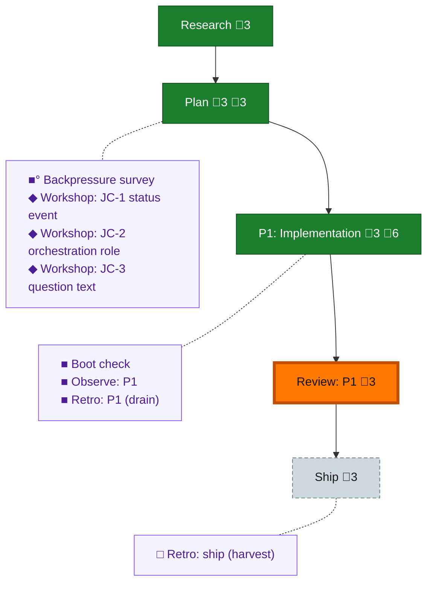

<!-- GENERATED by `harness flow render` — do not hand-edit; regenerate from the flow JSON. -->
# Flow · pij-rail-v2

**Kind**: flight-plan · **Now**: review-1 · **Next**: ship · **Intent**: pij rail v2: left-rail now/next fleet view in chainglass + cohesive pij-side plan for wee-albatross (status verb, sweep-adopt, watchdog nudge, role, question text). CG works in main; pij works in a worktree. Brief pij prime only once our plan is grounded. · **Nodes**: 13 · **Events**: 44

**Rail**: ◆─◆─[ ◆─◆─◇ ]  ◆ Research · ◆ Plan · [ ◆ P1: Implementation · ◆ Review: P1 · ◇ Ship ]

**Legend** — colour = type/status: 🟩 done · 🟢 in-progress · 🟥 blocked · 🟦 known · ⬜ assumed · 🔶 decision · 🗣 user input · 🟪 harness chore (faded = not yet done) · 🤖 companion · 🛠 worker · 🟧 current (you are here). Badges: 💬 comments · 📄 artifacts · 📝 instructions · 🧰 chore (° optional / recommended / ‼ strongly-recommended; ✓ done · ✕ skipped).

## Node log

### plan · Plan
- `2026-07-29T00:20:55.311Z` · agent · validation — opus validate-v2: NEEDS ATTENTION (0 crit / 4 high / 6 med) -&gt; all 10 folded in at plan v1.1.0; record + resolution table in validations/pij-rail-v2-plan-validation.md. Verdict basis: evidence base held (F-01..F-10 all spot-checked accurate); failures were in plan reasoning (JC-2 carrier collision, JC-3 false premise, unowned status trigger, unreachable-toggle routes).
- `2026-07-29T00:40:57.801Z` · user · decision — Jordan: brief pij prime when ready; its PM is ready to go; both sides use copilot gpt-5.6 sol coders + terra reviewers.
- `2026-07-29T00:51:43.891Z` · agent · note — Albatross ack: sibling plan s074-pij-rail-v2 allocated (worktree, branch s074/pij-rail-v2, PM pij-unwilling-butterfly), ratify-before-code is their hard first gate. Material intersection: their defect #35 (adopt prints bound / writes zero bytes on dissolved seats) gates our item 4 sweep-adopt — they sequence the #35 fix first. Ratify/amend + nine answers to come from albatross's own seat after it verifies its PM's review.

### phase-1 · P1: Implementation
- `2026-07-29T00:50:04.052Z` · agent · note — T001 done (thrush): shared leftPanelChildren record, desktop+mobile; targeted tests exit 0 (3 files / 11 tests). Chunk gate runs at T003.
- `2026-07-29T00:51:49.031Z` · agent · note — T002 done (thrush): 'pij' PanelMode on both surfaces, ?panel=pij deep-link parses, toast fixed; targeted tests exit 0 (3 files / 18 tests).
- `2026-07-29T01:13:58.641Z` · agent · validation — Chunk 2 (T004-T009b) CLOSED: falcon HIGH (seam not wired) + MEDIUM (delta path bypassed adapter) both fixed and confirmed; my gates: typecheck exit 0, full web suite 256 files / 2807 tests exit 0; grep-verified no local selection policy remains. Ratification amendments A-1/A-2 folded; A-4 statuses bound landed. Thrush on chunk 3 (T010-T013).

### backpressure · Backpressure survey
- `2026-07-29T00:21:10.723Z` · agent · validation — decision:unavailable reason:/eng-harness-flow router not present in this session's skill set (Layer-1 detection) time:2026-07-29T10:21+10:00 basis_sha256:52e01a29a8891208ee7ba10efb3b32a834d5e37a0e7d734138c10431dd9b01a4

### boot-1 · Boot check
- `2026-07-29T00:42:00.218Z` · agent · validation — decision:unavailable reason:/eng-harness-flow router not present in this session's skill set (Layer-1) time:2026-07-29T10:45+10:00

### observe-1 · Observe: P1
- `2026-07-29T01:35:18.159Z` · agent · validation — real capture: DL-001 (tsconfck EXTENDS_RESOLVE noise from stale standalone builds polluting every vitest gate log) via harness observe --kind difficulty, 2026-07-29

### retro-1 · Retro: P1 (drain)
- `2026-07-29T01:35:18.443Z` · agent · validation — decision:unavailable reason:/eng-harness-flow router not present in session skill set (Layer-1); DL-001 capture retained in .harness/temp/agent/session-buffer.md for a future drain time:2026-07-29T11:36+10:00
