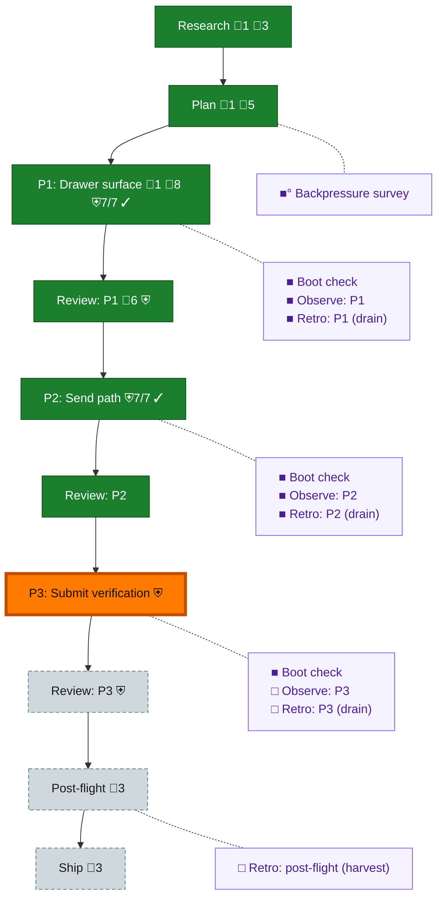

<!-- GENERATED by `harness flow render` — do not hand-edit; regenerate from the flow JSON. -->
# Flow · terminal-prompt-drawer

**Kind**: flight-plan · **Now**: phase-3 · **Next**: review-3 · **Intent**: Terminal prompt drawer: a toolbar button beside the palette/copy/close controls opens a full-height overlay (~1/3 width) listing prompts, each row showing the prompt start + ellipsis with two send actions — paste, and paste-then-Enter — into the live terminal. · **Nodes**: 21 · **Events**: 94

**Rail**: ◆─◆─[ ◆─◆─◆─◆─◇─◇─◇ ]─◇  ◆ Research · ◆ Plan · [ ◆ P1: Drawer surface · ◆ Review: P1 · ◆ P2: Send path · ◆ Review: P2 · ◇ P3: Submit verification · ◇ Review: P3 · ◇ Ship ] · ◇ Post-flight

**Legend** — colour = type/status: 🟩 done · 🟢 in-progress · 🟥 blocked · 🟦 known · ⬜ assumed · 🔶 decision · 🗣 user input · 🟪 harness chore (faded = not yet done) · 🤖 companion · 🛠 worker · 🟧 current (you are here). Badges: 💬 comments · 📄 artifacts · 📝 instructions · 🧰 chore (° optional / recommended / ‼ strongly-recommended; ✓ done · ✕ skipped) · ⛨ dd gate (terminal/total from the last evaluation; ✓ = open). ⛨✓/⛨✕ = a plan-validate check gate (green / not green).

## Node log

### research · Research
- `2026-08-08T00:44:55.094Z` · agent · validation — Ask is clear (verbatim brief + Jordan-owned prompt list); no dossier written. Seams source-verified read-only inline: terminal-pane-header.tsx:44-65 (shared control strip), terminal-overlay-panel.tsx (anchor-measured full-height float), terminal-ws.ts:241-245 (non-JSON WS frame -&gt; pty.write). Entry pre-flight boot fired: status=ok, just typecheck, 18803ms, clean.

### plan · Plan
- `2026-08-08T01:01:37.021Z` · user · decision — send path will be tmux sendkeys? talk to pij-continuing-ermine for hot tips on how to send keys successfully to coding agents.

### phase-1 · P1: Drawer surface
- `2026-08-08T01:32:23.927Z` · agent · validation — Phase 1 APPROVED. Coder claude-opus-5, cross-model reviewer gpt-5.6-terra. Reviewer Dim-0: Escape capture=true-&gt;false gave RED on escape.from-terminal-closes-drawer-only, escape.from-toggle-closes-drawer-only, escape.unbinds-on-close; parser entries.length===0-&gt;false gave RED on parsePromptList.fails-loudly-when-empty; both restored. Orchestrator sanity pass: re-read terminal-prompt-drawer.tsx:69-83 myself — capture-phase document listener with stopPropagation before onClose, bound only while open, unbound with matching capture flag; split-pane root now 'relative' (:33); header owns drawerOpen and renders the drawer once, so both hosts get it. Gates re-run by me: 20 files/231 tests, typecheck clean, lint clean, tree free of mutation residue.

### backpressure · Backpressure survey
- `2026-08-08T00:55:11.986Z` · agent · validation — decision:completed verdict:Partial reason:2 RUN / 8 EXTEND / 0 BUILD / 1 ABSENT over behaviour+architecture rows; no sensor needs building — every behaviour gap extends test/unit/web/features/064-terminal/, verified green today at 19 files / 208 tests / 7.6s. Sole ABSENT row is visual proportion (human-judgement). Artifacts: assets/backpressure.dd.json (authoritative, linked from every AC + done_when via pressure) and assets/backpressure-coverage.md. time:2026-08-08T00:55:00Z basis_sha256:de9442097cbc1d397f003da07dab49f215fcb73fd87b567454928497c7fbac59

### boot-1 · Boot check
- `2026-08-08T01:13:40.948Z` · agent · validation — decision:completed verdict:HEALTHY reason:real /eng-harness-flow --hook pre-flight invocation routed to boot; harness boot --json returned status=ok, command='just typecheck', durationMs=15363, all 9 tsconfig projects clean. Tree is green immediately before phase-1 code lands. time:2026-08-08T01:13:31Z

### observe-1 · Observe: P1
- `2026-08-08T01:32:24.046Z` · agent · validation — decision:completed reason:two real captures during phase 1, both via harness observe, not narrated. DL-003 — dd schema packages do not travel to a consuming repo, plan new cannot render or validate. DL-004 — authoring a dd plan turns 'just lint' red on generator-owned artifacts and cannot be fixed by formatting. Buffer: .harness/temp/agent/session-buffer.md. Both also filed upstream to pij-mental-dajeil (dd o-prime) and banked in its ledger. time:2026-08-08T01:30:00Z

### retro-1 · Retro: P1 (drain)
- `2026-08-08T01:33:43.940Z` · agent · validation — decision:completed reason:real /eng-harness-flow --hook post-coding invocation routed to retro drain. Drained 2 captured observations (DL-003 dd schemas do not travel; DL-004 dd artifacts redden the lint gate) plus 4 authored entries (2 wins, 1 insight, 1 coordination) into .harness/records/retro/2026-08-08/001-092-phase-1-drain.md, then harness observe --clear. DL-004 disposition fixed-now/encoded — biome ignores added, gate green. DL-003 disposition task/suggested — filed upstream, confirmed in AI-Substrate/dd ledger. time:2026-08-08T01:33:00Z

### boot-2 · Boot check
- `2026-08-08T23:41:31.792Z` · agent · validation — decision:completed verdict:HEALTHY reason:real /eng-harness-flow --hook pre-flight routed to boot at the phase-2 edge; harness boot --json status=ok, just typecheck, all 9 tsconfig projects clean, immediately before send-path code lands. time:2026-08-09

### observe-2 · Observe: P2
- `2026-08-09T00:32:41.348Z` · agent · validation — LATE RECEIPT — this node was flipped to done BEFORE this comment was written, which the doctrine treats as unsatisfied. Recorded rather than tidied; D5 forbids un-terminalizing. Twelve real captures were made during phase 2 via harness observe, not narrated: DL-001..DL-006, CONF-001/002, INS-001..INS-004. Buffer .harness/temp/agent/session-buffer.md, now drained and cleared. Sharpest is DL-006, a test green in the presence of the defect it named.

### retro-2 · Retro: P2 (drain)
- `2026-08-09T00:32:41.472Z` · agent · validation — LATE RECEIPT — same ordering breach as observe-2, and the drain itself ran AFTER the flip. Now genuinely executed: 12 observations drained plus 3 authored entries into .harness/records/retro/2026-08-09/001-092-phase-2-drain.md, then harness observe --clear. The breach is itself recorded in that file as CONF-003, with the encodable fix — a status flip and its receipt want to be ONE operation, since today they are two calls bound only by prose. time:2026-08-09T00:20:00Z

### boot-3 · Boot check
- `2026-08-09T00:36:00.321Z` · agent · validation — decision:completed verdict:HEALTHY reason:real /eng-harness-flow --hook pre-flight routed to boot at the phase-3 edge; harness boot --json status=ok, just typecheck, all 9 tsconfig projects clean. Receipt written BEFORE the status flip this time — the phase-2 breach was flipping first. time:2026-08-09
